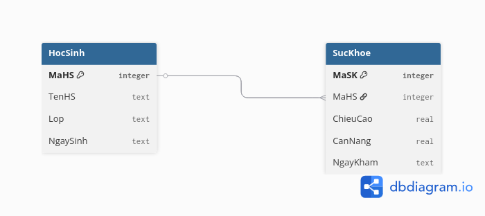
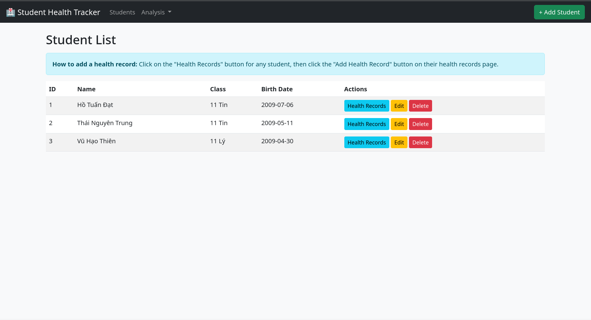
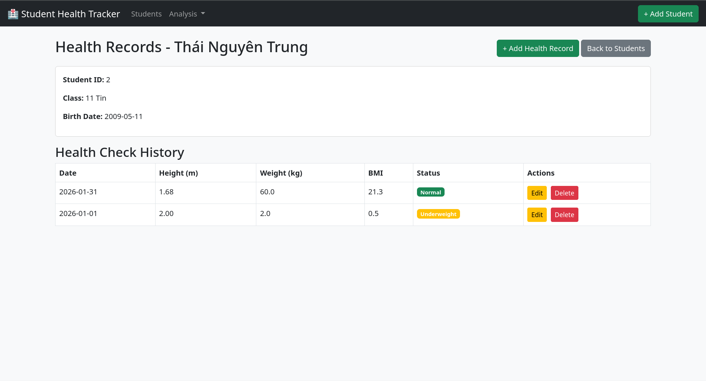
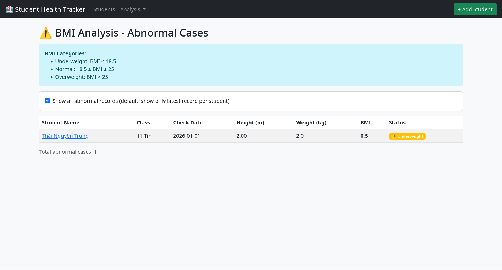
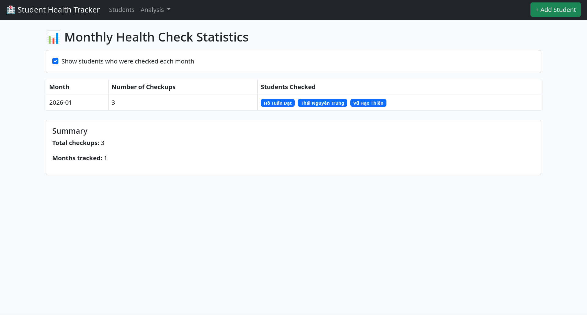
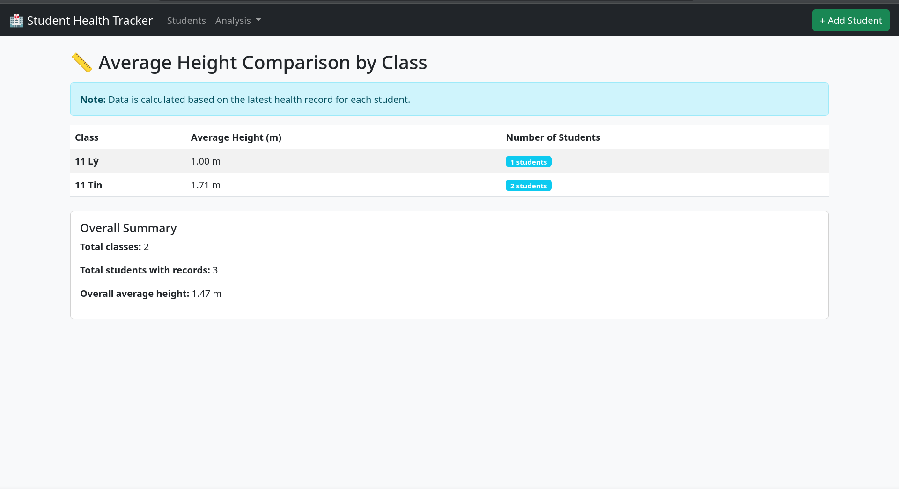

# Student Health Tracking System
## Project Report

---

## 1. Project Description

### 1.1 Topic / Application
This project is a *web application with SQLite database integration* designed to support school health management. The system helps store and analyze student health data across multiple periodic health checkups.

### 1.2 Objectives
- Manage student information in schools
- Track health checkups over time
- Identify students with abnormal BMI values
- Provide statistics and analysis to support school administration

### 1.3 Main Features
The application includes the following features:

#### *Student Management*
- Add new students
- View student list
- Edit student information
- Delete students

#### *Health Record Management*
- Each student can have multiple health checkups
- Add health records (height, weight, check date)
- Edit existing health records
- Delete health records
- View complete health history for each student

#### *Health Analysis*
- *BMI Analysis*: Calculate BMI and detect abnormal cases
  - Underweight: BMI < 18.5
  - Overweight: BMI > 25
  - Option to show all records or only latest per student
- *Monthly Statistics*: Track number of checkups per month
  - Optional display of checked students (clickable to view their records)
- *Height Comparison*: Compare average height by class (based on latest records)
- *Weight Comparison*: Compare average weight by class (based on latest records)

---

## 2. Database Description

### 2.1 Number of Tables
The database consists of *2 main tables*:

1. HocSinh (Students)
2. SucKhoe (Health Records)

---

### 2.2 Table: HocSinh (Students)

Stores basic student information.

| Column | Data Type | Description |
|--------|-----------|-------------|
| MaHS | INTEGER | Primary key (Student ID, auto-increment) |
| TenHS | TEXT | Student name |
| Lop | TEXT | Class |
| NgaySinh | TEXT | Birth date |

*Constraints:*
- MaHS: PRIMARY KEY, AUTOINCREMENT
- TenHS, Lop, NgaySinh: NOT NULL

---

### 2.3 Table: SucKhoe (Health Records)

Stores multiple health checkup records for students.

| Column | Data Type | Description |
|--------|-----------|-------------|
| MaSK | INTEGER | Primary key (Record ID, auto-increment) |
| MaHS | INTEGER | Foreign key linking to student |
| ChieuCao | REAL | Height in meters |
| CanNang | REAL | Weight in kilograms |
| NgayKham | TEXT | Checkup date |

*Constraints:*
- MaSK: PRIMARY KEY, AUTOINCREMENT
- MaHS: FOREIGN KEY → HocSinh(MaHS)
- ChieuCao, CanNang, NgayKham: NOT NULL

---

### 2.4 Table Relationships

---

## 3. Tools and Frameworks

### 3.1 Programming Language
- *Python* (version 3.7+)

### 3.2 Frameworks and Libraries

| Tool / Library | Version | Purpose |
|----------------|---------|---------|
| Flask | 2.x+ | Web framework for backend development |
| SQLite3 | Built-in | Embedded database for data storage |
| Bootstrap | 5.3.0 | Frontend CSS framework for responsive UI design |

#### *Flask*
- *Type:* Micro web framework
- *Usage:* 
  - Route handling (@app.route)
  - Template rendering with Jinja2
  - Request/response processing
  - Database connection management

#### *SQLite3*
- *Type:* Serverless, file-based SQL database
- *Usage:*
  - Data persistence in health.db file
  - SQL queries for CRUD operations
  - Complex queries with JOINs and aggregations

#### *Bootstrap 5*
- *Type:* Frontend framework
- *Usage:*
  - Responsive layout and grid system
  - Pre-styled components (tables, forms, buttons, cards, alerts)
  - Navigation bar and dropdowns
  - Badge styling for status indicators

### 3.3 Python Modules Used
- flask: Web application framework
- sqlite3: Database operations
- render_template: Template rendering
- request: HTTP request handling
- redirect, url_for: Navigation and URL management

---

## 4. Application Screenshots

The following screenshots demonstrate the key features of the Student Health Tracking System:

